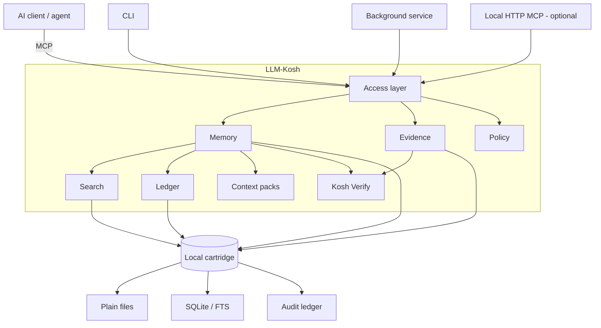

<div align="center">
  
  <h1>LLM-Kosh</h1>
  <p><strong>Local-first durable memory for AI agents.</strong></p>
  <p>Give Claude, Cursor, and other MCP-compatible clients persistent, inspectable memory without handing your workspace to a hosted memory service.</p>
  <p><strong>Kosh Verify makes that memory show its work:</strong> evidence, timing, causal paths, contradictions, inference boundaries, missing evidence, and abstention.</p>
  <p>
    <a href="https://pypi.org/project/llm-kosh/"></a>
    <a href="https://pypi.org/project/llm-kosh/"></a>
    <a href="https://github.com/rastogivaibhav/llm-kosh/actions/workflows/test.yml"></a>
    <a href="https://github.com/rastogivaibhav/llm-kosh/actions/workflows/quality.yml"></a>
    <a href="LICENSE"></a>
    <a href="https://github.com/rastogivaibhav/llm-kosh/stargazers"></a>
  </p>
  <p>
    <a href="#60-second-quickstart">Quickstart</a> ·
    <a href="#kosh-verify-memory-that-can-show-its-work">Kosh Verify</a> ·
    <a href="#architecture">Architecture</a> ·
    <a href="#use-with-mcp-clients">MCP</a> ·
    <a href="#security-model">Security</a> ·
    <a href="CONTRIBUTING.md">Contributing</a>
  </p>
</div>

<!-- mcp-name: io.github.rastogivaibhav/llm-kosh -->

---

## Why this exists

AI agents can reason across increasingly long workflows, but their memory is often either ephemeral or delegated to opaque hosted services.

**LLM-Kosh treats memory as local infrastructure:** inspectable, portable, auditable, permissioned, and usable across MCP-compatible clients.

It gives agents a durable memory layer built from ordinary local files plus structured indexes and governance controls:

- **Local-first** — your cartridge stays on your machine by default.
- **Inspectable** — memory remains readable, backupable, diffable, and reviewable.
- **Auditable** — mutations are recorded in a tamper-evident ledger.
- **Permissioned** — MCP starts read-only; write, mutation, and private export require explicit opt-in.
- **Portable** — one cartridge can support multiple compatible AI clients and workflows.
- **Evidence-aware** — Kosh Verify can distinguish support, contradiction, inference, evidence gaps, and absence.

> **Install it:** `python -m pip install --upgrade llm-kosh`

## Kosh Verify: memory that can show its work

Long-lived memory creates a different failure mode from a one-off bad answer: a weak or misunderstood memory can be recalled again in later sessions.

Kosh Verify is LLM-Kosh's evidence-aware verification surface. Given the evidence already present in a cartridge, it can produce a structured report containing temporal context, supporting facts, causal paths, contradictions, inferred-but-not-discovered relationships, missing evidence, stability information, and an explicit abstention state when there is not enough evidence.

It is **not a universal truth oracle** and it does not make an imported source trustworthy simply because it was stored. The aim is to preserve the difference between what the cartridge observed, what it inferred, what conflicts, and what it cannot support.

Try the deterministic synthetic incident demo:

```bash
llm-kosh --root ./kosh-demo kosh-verify \
  "Why did checkout fail and what evidence contradicts the explanation?" \
  --when "2026-05-01T13:30:00+00:00" \
  --depth 5 \
  --demo-seed \
  --json
```

`--demo-seed` writes synthetic incident evidence into the selected root, so use a disposable directory. The same behavior is covered by automated tests and a network-free acceptance harness:

```bash
python scripts/kosh_verify_acceptance.py
```

See [Kosh Verify](docs/KOSH_VERIFY.md) for the contract, boundaries, API example, and reproducible checks.

## What makes LLM-Kosh different

| Capability | LLM-Kosh |
| --- | --- |
| Local-first persistent memory | ✅ |
| MCP-native access | ✅ |
| Human-inspectable storage | ✅ |
| Tamper-evident mutation ledger | ✅ |
| Read-only-by-default agent access | ✅ |
| Evidence-backed context packs | ✅ |
| Temporal/causal verification | ✅ |
| Contradiction and evidence-gap reporting | ✅ |
| Explicit no-evidence abstention | ✅ |
| Hosted memory service required | ❌ |
| Automatic cloud sync required | ❌ |

## Architecture



The **repository root** contains the code. The **cartridge root** contains the live memory store. Watched **intake folders** can feed new material into the cartridge without mixing runtime data into the source checkout.

## 60-second quickstart

Python 3.10 or newer is required.

```bash
python -m pip install --upgrade llm-kosh
llm-kosh install --yes
llm-kosh status
```

That installs the package, creates the default cartridge at `~/.llmkosh/cartridge`, configures local defaults, and registers supported desktop integration where possible.

Create and query a custom cartridge:

```bash
llm-kosh --root ./my-cartridge init --owner "Local User"
llm-kosh --root ./my-cartridge add --kind note --title "First memory" --body "Hello"
llm-kosh --root ./my-cartridge query "Hello"
```

Manage the background service:

```bash
llm-kosh service start
llm-kosh service status
llm-kosh service stop
```

## What works today

The core project is usable now:

- Python package published as [`llm-kosh`](https://pypi.org/project/llm-kosh/)
- local CLI for creating, searching, importing, packing, and verifying cartridges
- Kosh Verify CLI and Python API for evidence-aware temporal/causal verification
- deterministic Kosh Verify incident demo and acceptance tests
- local MCP server
- background service for intake and maintenance jobs
- plain-file, inspectable storage with local indexes
- tamper-evident mutation ledger
- GitHub Actions test, quality, security-scanning, and publishing workflows
- experimental company-brain foundation for evidence-backed memory and cited context

The remaining release work is primarily desktop packaging polish and signing across Windows, macOS, and Linux. Kosh Verify is currently exposed through the CLI and Python API; direct exposure through the main MCP tool surface remains future work.

## Use with MCP clients

Start the MCP server against a cartridge:

```bash
llm-kosh --root ./my-cartridge mcp-server
```

The MCP server starts **read-only**.

Grant stronger capabilities only to clients that should have them:

```bash
llm-kosh --root ./my-cartridge mcp-server --allow-write
llm-kosh --root ./my-cartridge mcp-server --allow-write --allow-mutate
llm-kosh --root ./my-cartridge mcp-server --allow-private
```

MCP can also run over local HTTP:

```bash
llm-kosh --root ./my-cartridge mcp-server --http --port 8000
# endpoint: http://127.0.0.1:8000/mcp
```

Treat HTTP transport as a real network boundary if you expose it beyond loopback.

## Company-brain foundation

The experimental company-brain layer extends the cartridge beyond simple note recall. It introduces reference-first evidence, session and episode understanding, evidence-backed memories, review lifecycles, permission-first retrieval, and structured cited context packs.

Migrate an existing cartridge:

```bash
llm-kosh --root ./my-cartridge brain migrate --dry-run
llm-kosh --root ./my-cartridge brain migrate
llm-kosh --root ./my-cartridge brain health
llm-kosh --root ./my-cartridge brain context "Prepare the next project decision"
```

Register existing files without copying their source bytes:

```bash
llm-kosh --root ./my-cartridge brain register ./report.xlsx --artifact-type worksheet
llm-kosh --root ./my-cartridge brain inspect <evidence-id> \
  --locator '{"sheet":"Summary","range":"A1:F25"}'
llm-kosh --root ./my-cartridge brain evaluate
```

Build a replayable session or episode graph from a registered JSONL export:

```bash
llm-kosh --root ./my-cartridge brain register ./session.jsonl --artifact-type structured_data
llm-kosh --root ./my-cartridge brain understand <evidence-id> --dry-run
llm-kosh --root ./my-cartridge brain understand <evidence-id>
llm-kosh --root ./my-cartridge brain episodes --query "what was implemented"
```

See [Company brain foundation](docs/COMPANY_BRAIN.md).

## Core concepts

Three locations matter:

1. **Repository root** — the source checkout.
2. **Cartridge root** — the live memory store selected by `--root` or `LLMKOSH_ROOT`.
3. **Watched intake folders** — `receipts/`, `intake/`, and configured external drop folders.

If files are dropped into cartridge intake areas, the service can process them asynchronously. External folders can also be watched through `[daemon].watched_directories`.

## Optional features

```bash
python -m pip install "llm-kosh[watch]"     # filesystem events
python -m pip install "llm-kosh[server]"    # FastAPI service
python -m pip install "llm-kosh[semantic]"  # local semantic search
python -m pip install "llm-kosh[ingest]"    # document conversion helpers
python -m pip install "llm-kosh[all]"       # all optional features
```

MCP support is included in the base installation.

## Security model

LLM-Kosh is intentionally conservative around agent privilege and export boundaries:

- storage and search are local by default
- there is no automatic cloud sync or package telemetry
- MCP starts read-only
- write, mutation, and private-export capabilities require explicit opt-in
- optional HTTP transport is a real network boundary and should be configured accordingly
- exported context is checked for common secret patterns before sharing
- cartridge files are plaintext by design, so use operating-system disk encryption when local data at rest requires encryption

See [SECURITY.md](SECURITY.md) for the canonical threat model, reporting guidance, and current security boundaries.

## Project status

LLM-Kosh is actively maintained open-source infrastructure for durable agent memory.

The Python package, CLI, MCP server, local service, Kosh Verify surface, test workflow, and publishing path are operational. Current work focuses on interoperability, packaging, governed memory, evidence-aware verification, and making the project easier for external contributors to extend safely.

The Electron desktop app is packaged separately from the Python package. Local developer builds and Windows installer smoke tests are supported; public GA desktop distribution still requires verified Windows code signing and macOS Developer ID signing/notarization.

See [GA_READINESS.md](GA_READINESS.md) for the detailed release posture.

## Developer workflow

```bash
python -m pip install -e ".[server,watch,ingest]"
python -m pytest -q
```

Run the small public verification acceptance contract separately:

```bash
python scripts/kosh_verify_acceptance.py
```

For packaging or release changes:

```bash
python -m build
python -m twine check dist/*
```

Native C++ math acceleration is optional. Set `LLM_KOSH_BUILD_NATIVE=1` and install `pybind11` before building to test it. Release wheels use the portable pure-Python fallback.

## Contributing

Contributions are welcome, especially around:

- MCP interoperability
- tests and regression coverage
- packaging and cross-platform reliability
- documentation
- local-first memory workflows
- security hardening
- evidence and retrieval quality
- reproducible verification and benchmark methodology

Please read [CONTRIBUTING.md](CONTRIBUTING.md) before proposing substantial changes. Use GitHub Issues for reproducible, non-sensitive bugs and feature proposals, and follow [SECURITY.md](SECURITY.md) for security-sensitive reports.

## Documentation

| Guide | Purpose |
| --- | --- |
| [Quickstart](QUICKSTART.md) | First installation and local use |
| [Kosh Verify](docs/KOSH_VERIFY.md) | Evidence-aware verification contract and reproducible demo |
| [Architecture](docs/ARCHITECTURE.md) | System structure and design |
| [CLI reference](docs/CLI_REFERENCE.md) | Command reference |
| [MCP guide](docs/MCP_GUIDE.md) | MCP setup and usage |
| [Developer guide](docs/DEVELOPER_GUIDE.md) | Development workflow |
| [MCP developer guide](docs/MCP_DEVELOPER_GUIDE.md) | MCP internals |
| [Service developer guide](docs/SERVICE_DEVELOPER_GUIDE.md) | Background service internals |
| [Desktop developer guide](docs/DESKTOP_DEVELOPER_GUIDE.md) | Desktop packaging |
| [Release engineering](docs/RELEASE_ENGINEERING.md) | Build and release process |
| [Security](SECURITY.md) | Threat model and reporting |
| [GA readiness](GA_READINESS.md) | Current release posture |
| [Archived historical docs](docs/archive/README.md) | Historical material |

## Open source

LLM-Kosh is maintained in the open under the [MIT License](LICENSE).

Bug reports, focused pull requests, interoperability improvements, tests, and documentation contributions are welcome.

---

<div align="center">
  <strong>Memory should make agents more capable without making your workspace less yours.</strong>
</div>
