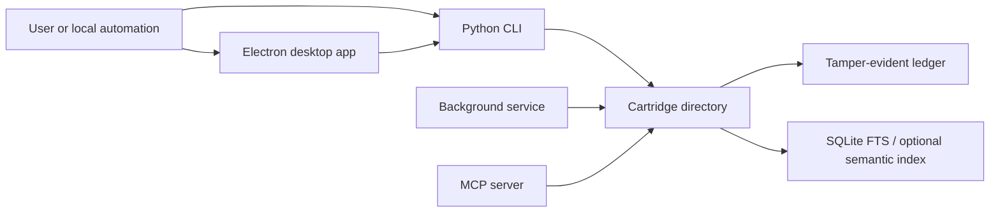
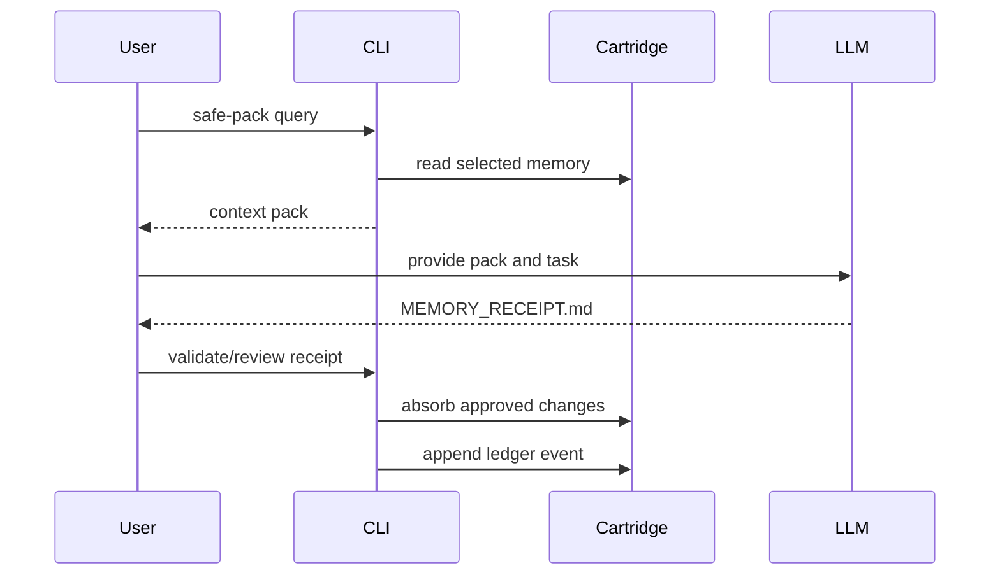

# Architecture

`llm-kosh` is a local memory runtime with four main responsibilities:

1. Store typed memory in a cartridge directory.
2. Index that memory for retrieval.
3. Expose safe local interfaces for humans, tools, and MCP clients.
4. Maintain an append-only ledger for auditability.

The design goal is a small, inspectable system that can run on a developer
machine without a hosted control plane.

## Component map



## Cartridge storage

A cartridge is a normal directory. The important properties are:

- memory objects are represented as human-readable files;
- structured metadata is stored with each object;
- derived indexes can be rebuilt from source files;
- mutations append events to the ledger;
- backups and Git workflows can operate on the cartridge without a database
  server.

The ledger is not a replacement for backups or encryption. It records event
order and hash continuity so corruption or unexpected mutation is easier to
detect.

## Runtime surfaces

### CLI

The CLI is the primary interface. It owns cartridge initialization, memory
creation, search, pack generation, receipt validation, ledger verification,
MCP startup, and service control.

### MCP server

`llm-kosh mcp-server` exposes cartridge tools to MCP clients. The default mode
is read-only. Write, mutation, and private-export operations are gated by
explicit capability flags and policy checks.

Supported transports:

- `stdio` for desktop AI clients;
- local streamable HTTP bound to `127.0.0.1` for local development and tests.

### Background service

`llm-kosh service` runs local maintenance work. It can watch intake and receipt
folders when `watchdog` is installed, and falls back to polling otherwise. The
service exposes a local health endpoint on `127.0.0.1`.

### Desktop app

The desktop app is a GUI client around the same CLI/service/MCP surfaces. The
renderer is isolated from Node APIs. Filesystem and process operations go
through explicit IPC handlers in the Electron main process.

## Pack and receipt loop

The safest collaboration path with an LLM is explicit export and explicit
absorption:



This keeps generated changes reviewable before they become cartridge memory.

## Security boundaries

- The MCP server is read-only unless capability flags are enabled.
- Private context export is separated from normal read/write permissions.
- Pack generation runs secret-pattern checks before producing shareable output.
- Untrusted AI output should enter through receipt validation or intake review.
- The desktop renderer cannot directly access arbitrary filesystem or process
  APIs.
- Local data is plaintext unless the host operating system encrypts the disk.

## Packaging model

The Python package is the canonical runtime. Desktop builds bundle a frozen
sidecar executable produced from the same Python entry points. The sidecar is
placed at `resources/bin/llm-kosh` or `resources/bin/llm-kosh.exe`.

Public desktop GA releases require platform signing:

- Windows: Authenticode signatures on installer and bundled executables.
- macOS: Developer ID signing and notarization.
- Linux: clean-host AppImage/deb smoke tests.

## Operational checks

Useful health checks:

```bash
llm-kosh status
llm-kosh verify-ledger
llm-kosh mcp-test
llm-kosh service status
```

Useful developer checks:

```bash
python -m pytest -q
python -m build
python -m json.tool server.json
```
