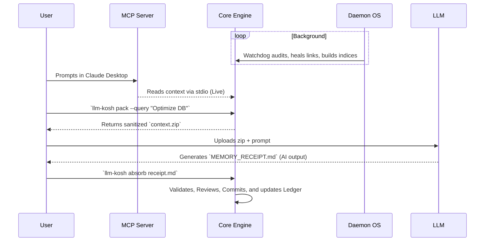

# Architecture Overview

`llm-kosh` is a self-contained operating system for AI interaction context. It is composed of highly decoupled layers that separate data ingestion from retrieval, background maintenance, and client interfaces.

## 1. Separation of Concerns

1. **The Core Engine:** The source of truth. Handles the filesystem-backed storage of typed memories (e.g., `decision`, `project`, `prompt`). It enforces structural schema and handles transactional backups.
2. **The Intake/Processor Pipeline:** The "Inbox". Raw files are dumped here. The control plane (`intake`) scans them, and declarative `processor` rules parse them to automatically suggest structured memory proposals.
3. **The Search Indices (FTS & Vector):** Memories are indexed using standard Full-Text Search (`index`) and semantically embedded (`embed`) via TF-IDF or local `sentence-transformers` for deep query resolution.
4. **The Daemon OS:** A background process running in `watchdog` or `polling` modes. It continuously audits the cartridge, self-heals broken links, updates search indices, and processes background jobs.

## 2. The Client Ecosystem

While the CLI is the foundation, `llm-kosh` provides diverse UI surfaces that act as lightweight clients communicating with the Core Engine:
- **The Electron Desktop App:** A graphical dashboard for controlling the Daemon, configuring Watched Folders, and managing outbound packs and inbound receipts via secure IPC channels.
- **The Local Workbench (`llm-kosh workbench`):** A browser-based interface served over local HTTP for rapid exploration and visualization of the memory map.
- **The MCP Server (`llm-kosh mcp-server`):** A Model Context Protocol server that allows modern AI IDEs (like Claude Desktop) to connect directly to the cartridge via `stdio` or HTTP, enabling live context retrieval.

## 3. The Storage Paradigm

`llm-kosh` innovates by treating your local disk as a highly-structured database.

- **Disk as Database:** All memory nodes are stored as flat Markdown files with strict YAML frontmatter. This means your AI memory is natively **version-controllable (Git-friendly)**, completely transparent, human-readable, and free from opaque vendor lock-in.
- **The Event-Sourced Ledger:** Every single mutation (adding a memory, absorbing a receipt, healing a link) is appended to an immutable, append-only ledger (`verify-ledger`). This guarantees that all AI interactions and system changes are 100% auditable.
- **Schema Evolution & Migrations:** Data structures evolve. The built-in migration engine (`llm-kosh migrate`) handles backwards compatibility and schema drift, ensuring zero-downtime upgrades for your local files when the `llm-kosh` standards update.

## 4. The Context Loop (Pack & Absorb)

The core workflow relies on a bidirectional loop with the LLM, coupled with a live IDE integration.

> [!TIP]
> **The Pack & Absorb Philosophy:** Never let an AI modify your code or context directly without an auditable paper trail. You `pack` what it needs, and you `absorb` its receipt.

## 5. Security Boundaries & Defensive Architecture

> [!IMPORTANT]  
> All exports (`pack`) pass through a rigid security layer that checks local `policy`, masks secrets (`redact`), and filters by visibility (`private` vs `shareable`).

**The Quarantine Airlock:** 
Architecturally, `quarantine` acts as a Dead Letter Queue for AI hallucinations and secrets. If the `intake` pipeline or the self-healing engine detects anomalous, malformed, or highly sensitive outputs that violate export policies, it intercepts them and throws them into the Quarantine Zone (`llm-kosh quarantine`). This defensive boundary ensures the core memory graph is never corrupted by bad LLM outputs.